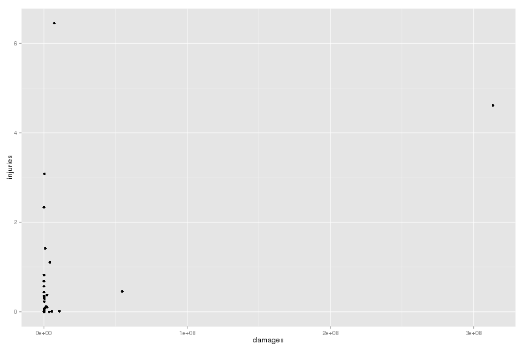

## Abstract

In this documents we study the fatalities, injuries and financial damages caused by weather events.
We focus ourselves in two different set of questions:

1. Are amount of fatalities, injuries and the financial cost correlated?

2. Which are the events that are more expensive in terms of fatalities, injuries and financial damages?

In order to achieve our goal, we load the file from the indicated url, and we clean up the data.
In the data there is two sorts of financial damages and we add one to the other.
Then, we compute the mean and the sum for the three concerned quantities.

There is a lot of mistakes on the strings indicating the type of event, then we filter all the small things (small amount of injuries and fatalities and financial damages).
So keep in mind that some data is removed from our anlysis. 
The right thing to do would be to read all the types and merge them together when necessary, but this would be a very time consuming process.

Finally, we plot the correlation between the average and the ranking according to the mean and the sum.

## Data Processing 

### Loading data

The data was obtained directly from the indicated url, and it was stored in the memory.


```r
  download.file("https://d396qusza40orc.cloudfront.net/repdata%2Fdata%2FStormData.csv.bz2", 
                "Storm_data.csv.bz2", method = "curl")
  data <- read.table("Storm_data.csv.bz2", sep = ",", head = TRUE, na.strings = "")
```

### Cleaning data

In order to clean the data, we remove the NA's. 
The amount of fatalities, injuries and damages if not present is replaced by 0.
The multiplicative factor for damage if not present is replaced by 1.


```r
  data$CROPDMG <- ifelse(is.na(data$CROPDMG), 0, data$CROPDMG)
  data$PROPDMG <- ifelse(is.na(data$PROPDMG), 0, data$PROPDMG)
  data$INJURIES <- ifelse(is.na(data$INJURIES), 0, data$INJURIES)
  data$FATALITIES <- ifelse(is.na(data$FATALITIES), 0, data$FATALITIES)
  data$CROPDMGEXP <- ifelse(is.na(data$CROPDMGEXP), "1", data$CROPDMGEXP)
  data$PROPDMGEXP <- ifelse(is.na(data$PROPDMGEXP), "1", data$PROPDMGEXP)
```

In order to simplify the computations all letters were transformed to capital letters.


```r
  data$CROPDMGEXP <- toupper(data$CROPDMGEXP)
  data$PROPDMGEXP <- toupper(data$PROPDMGEXP)
  data$EVTYPE <- toupper(data$EVTYPE)
```

The financial damage is simply the sum of the property and the crop damages.


```r
  data$FDMG <- data$PROPDMG * ifelse(data$PROPDMG == 'B', 1E9,
                                     ifelse(data$PROPDMG == 'M', 1E6,
                                            ifelse(data$PROPDMG == 'K', 1E3, 1))) + 
               data$CROPDMG * ifelse(data$CROPDMG == 'B', 1E9,
                                     ifelse(data$CROPDMG == 'M', 1E6,
                                            ifelse(data$CROPDMG == 'K', 1E3, 1)))
```

### Computing the mean and the total

The mean, the sum and the number was measured for every type of event.


```r
  dataSum <- aggregate(subset(data, select = c("INJURIES", "FATALITIES", "FDMG")), list(data$EVTYPE), sum)
  colnames(dataSum) <- c("EVTYPE", "INJURIESSUM", "FATALITIESSUM", "FDMGSUM")
  dataMean <- aggregate(subset(data, select = c("INJURIES", "FATALITIES", "FDMG")), list(data$EVTYPE), mean)
  colnames(dataMean) <- c("EVTYPE", "INJURIESMEAN", "FATALITIESMEAN", "FDMGMEAN")
  dataFinal <- merge(dataSum, dataMean)
  remove(data, dataSum, dataMean)
```

In fact there are a lot of misprints on the data. For example, the same event type may appear repeated with two different names either a misprint either just a different way of looking to that type.

The right way of solving this should be to gather all the equivalent types, but this is a slow process and we would need to understand all the subtleties of it.
Therefore we only accept types that are in the top 30 of number of injuries, fatalities or financial damages.


```r
  maxInjuries <- sort(dataFinal$INJURIESSUM, TRUE)[30]
  maxFatalities <- sort(dataFinal$FATALITIESSUM, TRUE)[30]
  maxFdmg <- sort(dataFinal$FDMGSUM, TRUE)[30]
  dataFinal <- subset(dataFinal, dataFinal$INJURIESSUM > maxInjuries | dataFinal$FATALITIESSUM > maxFatalities | dataFinal$FDMGSUM > maxFdmg)
```

## Results

We do two different anlysis, first the relation between different variables, and the second we do a rank for each variable.

### Damage-fatalities plot

The damages and fatalies are related as shows the following plot:


```r
  library(ggplot2)
  pl <- ggplot(dataFinal, aes(x = FDMGMEAN, y = FATALITIESMEAN)) + geom_point()
  pl <- pl + xlab("damages") + ylab("fatalities")
  print(pl)
```

 

  There are a lot of financially expensive events that do not cost many lives. And the other way arround.
  In fact this plots show that we can split between financially expensive events and fatal events.

### Damage-injuries plot

The damages and injuries are related as follows:


```r
  pl <- ggplot(dataFinal, aes(x = FDMGMEAN, y = INJURIESMEAN)) + geom_point()
  pl <- pl + xlab("damages") + ylab("injuries")
  print(pl)
```

 

The seperation betweem financial expensive and humanly expensive events is not as clear as before, in fact, there is an event that is both: very financial and humanly expensive.

### Fatalities-injuries plot

The fatalities and injuries are related as follows:


```r
  pl <- ggplot(dataFinal, aes(x = FATALITIESMEAN, y = INJURIESMEAN)) + geom_point()
  pl <- pl + xlab("fatalities") + ylab("injuries")
  print(pl)
```

 

It comes without surprise that there is a relation between fatalities and number of injuries.

### Damage rank

The ranking of financial damage in total:


```r
  head(subset(dataFinal[with(dataFinal, order(-FDMGSUM)),],select = c("EVTYPE", "FDMGSUM")), 20)
```

```
##                 EVTYPE FDMGSUM
## 758            TORNADO 3312277
## 138        FLASH FLOOD 1599325
## 779          TSTM WIND 1445198
## 212               HAIL 1268290
## 154              FLOOD 1067976
## 685  THUNDERSTORM WIND  943636
## 418          LIGHTNING  606932
## 711 THUNDERSTORM WINDS  464978
## 320          HIGH WIND  342015
## 888       WINTER STORM  134700
## 274         HEAVY SNOW  124418
## 875           WILDFIRE   88824
## 387          ICE STORM   67690
## 604        STRONG WIND   64629
## 254         HEAVY RAIN   61965
## 337         HIGH WINDS   57385
## 772     TROPICAL STORM   54323
## 873   WILD/FOREST FIRE   43534
## 84             DROUGHT   37998
## 149     FLASH FLOODING   33623
```

The ranking of financial damage in average:

```r
  head(subset(dataFinal[with(dataFinal, order(-FDMGMEAN)),],select = c("EVTYPE", "FDMGMEAN")), 20)
```

```
##                 EVTYPE FDMGMEAN
## 372  HURRICANE/TYPHOON   120.88
## 363          HURRICANE   119.84
## 529        RIVER FLOOD   100.26
## 772     TROPICAL STORM    78.73
## 599        STORM SURGE    74.32
## 826        URBAN FLOOD    56.64
## 758            TORNADO    54.61
## 149     FLASH FLOODING    49.30
## 154              FLOOD    42.17
## 418          LIGHTNING    38.53
## 337         HIGH WINDS    37.43
## 387          ICE STORM    33.74
## 160  FLOOD/FLASH FLOOD    32.93
## 875           WILDFIRE    32.17
## 399          LANDSLIDE    31.66
## 873   WILD/FOREST FIRE    29.88
## 138        FLASH FLOOD    29.47
## 711 THUNDERSTORM WINDS    22.31
## 397   LAKE-EFFECT SNOW    22.23
## 125       EXTREME COLD    21.00
```

### Fatalities rank

The ranking of the number of fatalities in total:


```r
  head(subset(dataFinal[with(dataFinal, order(-FATALITIESSUM)),],select = c("EVTYPE", "FATALITIESSUM")), 20)
```

```
##                      EVTYPE FATALITIESSUM
## 758                 TORNADO          5633
## 116          EXCESSIVE HEAT          1903
## 138             FLASH FLOOD           978
## 243                    HEAT           937
## 418               LIGHTNING           816
## 779               TSTM WIND           504
## 154                   FLOOD           470
## 524             RIP CURRENT           368
## 320               HIGH WIND           248
## 19                AVALANCHE           224
## 888            WINTER STORM           206
## 525            RIP CURRENTS           204
## 245               HEAT WAVE           172
## 125            EXTREME COLD           162
## 685       THUNDERSTORM WIND           133
## 274              HEAVY SNOW           127
## 126 EXTREME COLD/WIND CHILL           125
## 312               HIGH SURF           104
## 604             STRONG WIND           103
## 28                 BLIZZARD           101
```

The ranking of the number of fatalities in average:

```r
  head(subset(dataFinal[with(dataFinal, order(-FATALITIESMEAN)),],select = c("EVTYPE", "FATALITIESMEAN")), 20)
```

```
##                      EVTYPE FATALITIESMEAN
## 127            EXTREME HEAT        4.36364
## 245               HEAT WAVE        2.29333
## 243                    HEAT        1.22164
## 116          EXCESSIVE HEAT        1.13409
## 524             RIP CURRENT        0.78298
## 372       HURRICANE/TYPHOON        0.72727
## 525            RIP CURRENTS        0.67105
## 19                AVALANCHE        0.58031
## 363               HURRICANE        0.35057
## 125            EXTREME COLD        0.24658
## 69          COLD/WIND CHILL        0.17625
## 312               HIGH SURF        0.14169
## 126 EXTREME COLD/WIND CHILL        0.12475
## 171                     FOG        0.11524
## 758                 TORNADO        0.09287
## 772          TROPICAL STORM        0.08406
## 399               LANDSLIDE        0.06333
## 418               LIGHTNING        0.05180
## 105              DUST STORM        0.05152
## 599             STORM SURGE        0.04981
```

### Injuries rank

The ranking of the number of injuries in total:


```r
  head(subset(dataFinal[with(dataFinal, order(-INJURIESSUM)),],select = c("EVTYPE", "INJURIESSUM")), 20)
```

```
##                 EVTYPE INJURIESSUM
## 758            TORNADO       91346
## 779          TSTM WIND        6957
## 154              FLOOD        6789
## 116     EXCESSIVE HEAT        6525
## 418          LIGHTNING        5230
## 243               HEAT        2100
## 387          ICE STORM        1975
## 138        FLASH FLOOD        1777
## 685  THUNDERSTORM WIND        1488
## 212               HAIL        1361
## 888       WINTER STORM        1321
## 372  HURRICANE/TYPHOON        1275
## 320          HIGH WIND        1137
## 274         HEAVY SNOW        1021
## 875           WILDFIRE         911
## 711 THUNDERSTORM WINDS         908
## 28            BLIZZARD         805
## 171                FOG         734
## 873   WILD/FOREST FIRE         545
## 105         DUST STORM         440
```

The ranking of the number of injuries in average:


```r
  head(subset(dataFinal[with(dataFinal, order(-INJURIESMEAN)),],select = c("EVTYPE", "INJURIESMEAN")), 20)
```

```
##                EVTYPE INJURIESMEAN
## 372 HURRICANE/TYPHOON      14.4886
## 127      EXTREME HEAT       7.0455
## 245         HEAT WAVE       5.0533
## 116    EXCESSIVE HEAT       3.8886
## 243              HEAT       2.7379
## 758           TORNADO       1.5061
## 171               FOG       1.3643
## 105        DUST STORM       1.0304
## 387         ICE STORM       0.9845
## 525      RIP CURRENTS       0.9770
## 524       RIP CURRENT       0.4936
## 772    TROPICAL STORM       0.4928
## 19          AVALANCHE       0.4404
## 873  WILD/FOREST FIRE       0.3741
## 125      EXTREME COLD       0.3516
## 418         LIGHTNING       0.3320
## 875          WILDFIRE       0.3300
## 28           BLIZZARD       0.2961
## 154             FLOOD       0.2681
## 78          DENSE FOG       0.2645
```
