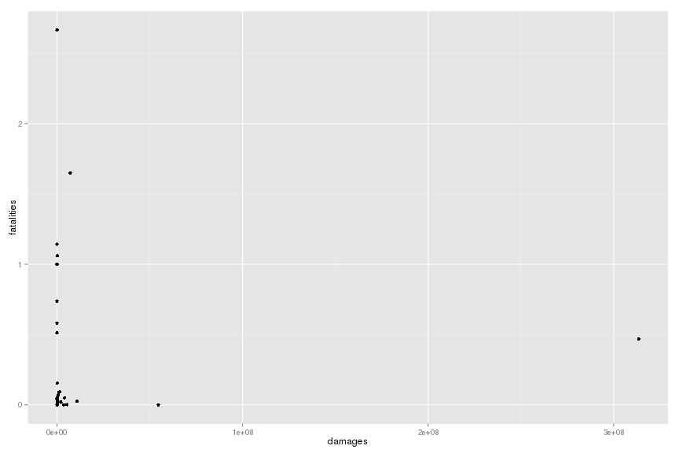

## Abstract

In this documents we study the fatalities, injuries and financial damages caused by weather events.
We focus ourselves in two different set of questions:

1. Are amount of fatalities, injuries and the financial cost correlated?

2. Which are the events that are more expensive in terms of fatalities, injuries and financial damages?

In order to achieve our goal, we load the file from the indicated url, and we clean up the data.
In the data there is two sorts of financial damages and we add one to the other.
Then, we compute the mean and the sum for the three concerned quantities.

There is a lot of mistakes on the strings indicating the type of event, then we filter all the small things (small amount of injuries and fatalities and financial damages).
So keep in mind that some data is removed from our anlysis. 
The right thing to do would be to read all the types and merge them together when necessary, but this would be a very time consuming process.

Finally, we plot the correlation between the average and the ranking according to the mean and the sum.

## Data Processing 

### Loading data

The data was obtained directly from the indicated url, and it was stored in the memory.


```r
  download.file("https://d396qusza40orc.cloudfront.net/repdata%2Fdata%2FStormData.csv.bz2", 
                "Storm_data.csv.bz2", method = "curl")
  data <- read.table("Storm_data.csv.bz2", sep = ",", head = TRUE, na.strings = "")
```

### Cleaning data

In order to clean the data, we remove the NA's. 
The amount of fatalities, injuries and damages if not present is replaced by 0.


```r
  data$CROPDMG <- ifelse(is.na(data$CROPDMG), 0, data$CROPDMG)
  data$PROPDMG <- ifelse(is.na(data$PROPDMG), 0, data$PROPDMG)
  data$INJURIES <- ifelse(is.na(data$INJURIES), 0, data$INJURIES)
  data$FATALITIES <- ifelse(is.na(data$FATALITIES), 0, data$FATALITIES)
```

Let us tranform the exponents in readable numbers, first the crop damages:

```r
  summary(data$CROPDMGEXP)
```

```
##      ?      0      2      B      k      K      m      M   NA's 
##      7     19      1      9     21 281832      1   1994 618413
```

```r
  data$CROPDMGEXP <- ifelse(is.na(data$CROPDMGEXP), 1,
                ifelse(data$CROPDMGEXP == "B", 1E9,
                ifelse(data$CROPDMGEXP == "M", 1E6,
                ifelse(data$CROPDMGEXP == "m", 1E6,
                ifelse(data$CROPDMGEXP == "K", 1E3,
                ifelse(data$CROPDMGEXP == "k", 1E3,
                ifelse(data$CROPDMGEXP == "2", 1E2, 1)))))))
```

And the property damages:

```r
  summary(data$PROPDMGEXP)
```

```
##      -      ?      +      0      1      2      3      4      5      6 
##      1      8      5    216     25     13      4      4     28      4 
##      7      8      B      h      H      K      m      M   NA's 
##      5      1     40      1      6 424665      7  11330 465934
```

```r
  data$PROPDMGEXP <- ifelse(is.na(data$PROPDMGEXP), 1,
                ifelse(data$PROPDMGEXP == "B", 1E9,
                ifelse(data$PROPDMGEXP == "M", 1E6,
                ifelse(data$PROPDMGEXP == "m", 1E6,
                ifelse(data$PROPDMGEXP == "K", 1E3,
                ifelse(data$PROPDMGEXP == "H", 1E2,
                ifelse(data$PROPDMGEXP == "h", 1E2,
                ifelse(data$PROPDMGEXP == "8", 1E8,
                ifelse(data$PROPDMGEXP == "7", 1E7,
                ifelse(data$PROPDMGEXP == "6", 1E6,
                ifelse(data$PROPDMGEXP == "5", 1E5,
                ifelse(data$PROPDMGEXP == "4", 1E4,
                ifelse(data$PROPDMGEXP == "3", 1E3,
                ifelse(data$PROPDMGEXP == "2", 1E2,
                ifelse(data$PROPDMGEXP == "1", 1E1, 1)))))))))))))))
```


The multiplicative factor for damage if not present is replaced by 1.

In order to simplify the computations all event types were transformed to capital letters. 
And gather them in 40 categories.


```r
  data$EVTYPE <- toupper(data$EVTYPE)
  data$EVTYPE[grep("HAIL", data$EVTYPE)] <- "HAIL"
  data$EVTYPE[grep("TORNADO", data$EVTYPE)] <- "TORNADO"
  data$EVTYPE[grep("SPOUT", data$EVTYPE)] <- "TORNADO"
  data$EVTYPE[grep("TORNDAO", data$EVTYPE)] <- "TORNADO"
  data$EVTYPE[grep("HURRICANE", data$EVTYPE)] <- "HURRICANE"
  data$EVTYPE[grep("FLOOD", data$EVTYPE)] <- "FLOOD"
  data$EVTYPE[grep("THUNDER", data$EVTYPE)] <- "THUNDERSTORM"
  data$EVTYPE[grep("GUSTNADO", data$EVTYPE)] <- "THUNDERSTORM"
  data$EVTYPE[grep("TSTM", data$EVTYPE)] <- "THUNDERSTORM"
  data$EVTYPE[grep("TIDE", data$EVTYPE)] <- "TIDES"
  data$EVTYPE[grep("WIND", data$EVTYPE)] <- "WIND"
  data$EVTYPE[grep("WND", data$EVTYPE)] <- "WIND"
  data$EVTYPE[grep("FIRE", data$EVTYPE)] <- "FIRE" 
  data$EVTYPE[grep("RAIN", data$EVTYPE)] <- "RAIN"
  data$EVTYPE[grep("SNOW", data$EVTYPE)] <- "SNOW"
  data$EVTYPE[grep("SLEET", data$EVTYPE)] <- "SNOW"
  data$EVTYPE[grep("FOG", data$EVTYPE)] <- "FOG" 
  data$EVTYPE[grep("ICE", data$EVTYPE)] <- "ICE"
  data$EVTYPE[grep("ICY", data$EVTYPE)] <- "ICE"
  data$EVTYPE[grep("GLAZE", data$EVTYPE)] <- "ICE"
  data$EVTYPE[grep("COLD", data$EVTYPE)] <- "COLD"
  data$EVTYPE[grep("FREEZ", data$EVTYPE)] <- "COLD"
  data$EVTYPE[grep("FROST", data$EVTYPE)] <- "COLD"
  data$EVTYPE[grep("LOW TEMP", data$EVTYPE)] <- "COLD"
  data$EVTYPE[grep("HEAT", data$EVTYPE)] <- "HEAT"
  data$EVTYPE[grep("HOT", data$EVTYPE)] <- "HEAT"
  data$EVTYPE[grep("WARM", data$EVTYPE)] <- "HEAT"
  data$EVTYPE[grep("HIGH TEMP", data$EVTYPE)] <- "HEAT"
  data$EVTYPE[grep("DRY", data$EVTYPE)] <- "DROUGHT"
  data$EVTYPE[grep("DROUGHT", data$EVTYPE)] <- "DROUGHT"
  data$EVTYPE[grep("DRIEST", data$EVTYPE)] <- "DROUGHT"
  data$EVTYPE[grep("DUST", data$EVTYPE)] <- "DUST" 
  data$EVTYPE[grep("STORM", data$EVTYPE)] <- "STORM"
  data$EVTYPE[grep("SHOWER", data$EVTYPE)] <- "RAIN"
  data$EVTYPE[grep("PRECI",data$EVTYPE)] <- "RAIN"
  data$EVTYPE[grep("WINTER",data$EVTYPE)] <- "RAIN"
  data$EVTYPE[grep("WINTRY",data$EVTYPE)] <- "RAIN"
  data$EVTYPE[grep("LIGHT", data$EVTYPE)] <- "LIGHTNING"
  data$EVTYPE[grep("WET", data$EVTYPE)] <- "WETNESS" 
  data$EVTYPE[grep("FLOOODING", data$EVTYPE)] <- "FLOOD" 
  data$EVTYPE[grep("FLD", data$EVTYPE)] <- "FLOOD" 
  data$EVTYPE[grep("STREAM", data$EVTYPE)] <- "FLOOD" 
  data$EVTYPE[grep("SURF", data$EVTYPE)] <- "SURF ADVISORY"
  data$EVTYPE[grep("AVA", data$EVTYPE)] <- "AVALANCHE"
  data$EVTYPE[grep("VOLCANIC", data$EVTYPE)] <- "VOLCANIC EVENT"
  data$EVTYPE[grep("VOG", data$EVTYPE)] <- "VOLCANIC EVENT"
  data$EVTYPE[grep("SLIDE", data$EVTYPE)] <- "LANDSLIDE"
  data$EVTYPE[grep("SLUMP", data$EVTYPE)] <- "LANDSLIDE"
  data$EVTYPE[grep("EROSION", data$EVTYPE)] <- "COASTAL EROSION"
  data$EVTYPE[grep("EROSIN", data$EVTYPE)] <- "COASTAL EROSION"
  data$EVTYPE[grep("COASTAL", data$EVTYPE)] <- "COASTAL EROSION"
  data$EVTYPE[grep("RIP", data$EVTYPE)] <- "RIP CURRENT"
  data$EVTYPE[grep("BLIZZARD", data$EVTYPE)] <- "BLIZZARD"
  data$EVTYPE[grep("CLOUD", data$EVTYPE)] <- "WALL/FUNNEL CLOUDS"
  data$EVTYPE[grep("FUNNEL", data$EVTYPE)] <- "WALL/FUNNEL CLOUDS"
  data$EVTYPE[grep("DAM", data$EVTYPE)] <- "DAM ACCIDENT"
  data$EVTYPE[grep("SEAS",data$EVTYPE)] <- "ROUGH SEAS"
  data$EVTYPE[grep("WAVE",data$EVTYPE)] <- "ROUGH SEAS"
  data$EVTYPE[grep("WATER",data$EVTYPE)] <- "ROUGH SEAS"
  data$EVTYPE[grep("SWELL",data$EVTYPE)] <- "ROUGH SEAS"
  data$EVTYPE[grep("COOL", data$EVTYPE)] <- "COLD"
  data$EVTYPE[grep("SMOKE",data$EVTYPE)] <- "SMOKE"
  data$EVTYPE[grep("BURST",data$EVTYPE)] <- "DOWNBURST"
  data$EVTYPE[grep("MARINE",data$EVTYPE)] <- "MARINE ACCIDENT"
  data$EVTYPE[grep("HYPOTHERMIA",data$EVTYPE)] <- "HYPOTHERMIA"
  data$EVTYPE[grep("HYPERTHERMIA",data$EVTYPE)] <- "HYPERTHERMIA"
  data$EVTYPE[grep("TURBULENCE",data$EVTYPE)] <- "TURBULENCE"
  data$EVTYPE[grep("SUMMARY", data$EVTYPE)] <- "OTHER"
  data$EVTYPE[grep("TEMPERATURE", data$EVTYPE)] <- "OTHER"
  data$EVTYPE[grep("URBAN", data$EVTYPE)] <- "OTHER"
  data$EVTYPE[grep("NONE", data$EVTYPE)] <- "OTHER"
  data$EVTYPE[grep("RECORD", data$EVTYPE)] <- "OTHER"
  data$EVTYPE[grep("APACHE", data$EVTYPE)] <- "OTHER"
  data$EVTYPE[grep("NO SEVERE", data$EVTYPE)] <- "OTHER"
  data$EVTYPE[grep("PATTERN", data$EVTYPE)] <- "OTHER"
  data$EVTYPE[grep("HIGH", data$EVTYPE)] <- "OTHER"
  data$EVTYPE[grep("HEAVY", data$EVTYPE)] <- "OTHER"
  data$EVTYPE[grep("SOUTHEAST", data$EVTYPE)] <- "OTHER"
  data$EVTYPE[grep("EXCESSIVE", data$EVTYPE)] <- "OTHER"
  data$EVTYPE[grep("SEICHE", data$EVTYPE)] <- "OTHER"
  data$EVTYPE[grep("RED FLAG", data$EVTYPE)] <- "OTHER"
  data$EVTYPE[grep("FLOYD", data$EVTYPE)] <- "OTHER"
  data$EVTYPE[grep("\\?", data$EVTYPE)] <- "OTHER"
```

The financial damage is simply the sum of the property and the crop damages.


```r
  data$FDMG <- data$PROPDMG * data$PROPDMGEXP + data$CROPDMG * data$CROPDMGEXP
```

### Computing the mean and the total

The mean, the sum and the number was measured for every type of event.


```r
  dataSum <- aggregate(subset(data, select = c("INJURIES", "FATALITIES", "FDMG")), list(data$EVTYPE), sum)
  colnames(dataSum) <- c("EVTYPE", "INJURIESSUM", "FATALITIESSUM", "FDMGSUM")
  dataMean <- aggregate(subset(data, select = c("INJURIES", "FATALITIES", "FDMG")), list(data$EVTYPE), mean)
  colnames(dataMean) <- c("EVTYPE", "INJURIESMEAN", "FATALITIESMEAN", "FDMGMEAN")
  dataFinal <- merge(dataSum, dataMean)
  remove(data, dataSum, dataMean)
```

## Results

We do two different anlysis, first the relation between different variables, and the second we do a rank for each variable.

### Damage-fatalities plot

The damages and fatalies are related as shows the following plot:


```r
  library(ggplot2)
```

```
## Find out what's changed in ggplot2 with
## news(Version == "1.0.0", package = "ggplot2")
```

```r
  pl <- ggplot(dataFinal, aes(x = FDMGMEAN, y = FATALITIESMEAN)) + geom_point()
  pl <- pl + xlab("damages") + ylab("fatalities")
  print(pl)
```

 

  There are a lot of financially expensive events that do not cost many lives. And the other way arround.
  In fact this plots show that we can split between financially expensive events and fatal events.

### Damage-injuries plot

The damages and injuries are related as follows:


```r
  pl <- ggplot(dataFinal, aes(x = FDMGMEAN, y = INJURIESMEAN)) + geom_point()
  pl <- pl + xlab("damages") + ylab("injuries")
  print(pl)
```

 

The seperation betweem financial expensive and humanly expensive events is not as clear as before, in fact, there is an event that is both: very financial and humanly expensive.

### Fatalities-injuries plot

The fatalities and injuries are related as follows:


```r
  pl <- ggplot(dataFinal, aes(x = FATALITIESMEAN, y = INJURIESMEAN)) + geom_point()
  pl <- pl + xlab("fatalities") + ylab("injuries")
  print(pl)
```

 

It comes without surprise that there is a relation between fatalities and number of injuries.

### Damage rank

The ranking of financial damage in total:


```r
  head(subset(dataFinal[with(dataFinal, order(-FDMGSUM)),],select = c("EVTYPE", "FDMGSUM")), 20)
```

```
##       EVTYPE   FDMGSUM
## 11     FLOOD 1.807e+11
## 15 HURRICANE 9.027e+10
## 29     STORM 7.080e+10
## 32   TORNADO 5.743e+10
## 13      HAIL 2.074e+10
## 7    DROUGHT 1.503e+10
## 18       ICE 8.981e+09
## 10      FIRE 8.905e+09
## 40      WIND 7.048e+09
## 31     TIDES 4.652e+09
## 24      RAIN 4.097e+09
## 4       COLD 3.550e+09
## 28      SNOW 1.151e+09
## 20 LIGHTNING 9.425e+08
## 14      HEAT 9.248e+08
## 2   BLIZZARD 7.714e+08
## 36   TYPHOON 6.011e+08
## 19 LANDSLIDE 3.474e+08
## 39   WETNESS 1.470e+08
## 34   TSUNAMI 1.441e+08
```

The ranking of financial damage in average:

```r
  head(subset(dataFinal[with(dataFinal, order(-FDMGMEAN)),],select = c("EVTYPE", "FDMGMEAN")), 20)
```

```
##             EVTYPE  FDMGMEAN
## 15       HURRICANE 313442614
## 36         TYPHOON  54641364
## 31           TIDES  10793000
## 34         TSUNAMI   7204100
## 7          DROUGHT   5420426
## 18             ICE   4133207
## 39         WETNESS   3586220
## 10            FIRE   2100215
## 11           FLOOD   2097273
## 4             COLD   1453096
## 32         TORNADO    889651
## 19       LANDSLIDE    536131
## 14            HEAT    308268
## 2         BLIZZARD    283281
## 40            WIND    250258
## 29           STORM    203374
## 5     DAM ACCIDENT    200400
## 24            RAIN    199416
## 3  COASTAL EROSION    170750
## 30   SURF ADVISORY     95461
```
As we can see, floods are the events that give more financial damages, however if we compute the mean damage per event, hurricane is by far the worst event. 

### Fatalities rank

The ranking of the number of fatalities in total:


```r
  head(subset(dataFinal[with(dataFinal, order(-FATALITIESSUM)),],select = c("EVTYPE", "FATALITIESSUM")), 20)
```

```
##           EVTYPE FATALITIESSUM
## 32       TORNADO          5639
## 14          HEAT          3178
## 11         FLOOD          1553
## 29         STORM          1025
## 20     LIGHTNING           817
## 40          WIND           695
## 25   RIP CURRENT           572
## 4           COLD           226
## 1      AVALANCHE           225
## 24          RAIN           176
## 30 SURF ADVISORY           163
## 28          SNOW           160
## 15     HURRICANE           135
## 18           ICE           109
## 2       BLIZZARD           101
## 10          FIRE            90
## 12           FOG            81
## 13          HAIL            45
## 19     LANDSLIDE            44
## 34       TSUNAMI            33
```

The ranking of the number of fatalities in average:

```r
  head(subset(dataFinal[with(dataFinal, order(-FATALITIESMEAN)),],select = c("EVTYPE", "FATALITIESMEAN")), 20)
```

```
##             EVTYPE FATALITIESMEAN
## 22 MARINE ACCIDENT        2.66667
## 34         TSUNAMI        1.65000
## 17     HYPOTHERMIA        1.14286
## 14            HEAT        1.05933
## 8         DROWNING        1.00000
## 16    HYPERTHERMIA        1.00000
## 25     RIP CURRENT        0.73902
## 1        AVALANCHE        0.58140
## 26      ROUGH SEAS        0.51163
## 15       HURRICANE        0.46875
## 30   SURF ADVISORY        0.15334
## 4             COLD        0.09251
## 32         TORNADO        0.08736
## 19       LANDSLIDE        0.06790
## 20       LIGHTNING        0.05183
## 18             ICE        0.05016
## 12             FOG        0.04302
## 9             DUST        0.04096
## 2         BLIZZARD        0.03709
## 31           TIDES        0.02552
```

The events with more fatalities are tornados, heat periods and floods.
The mean rank is dominated by very low frequent events and so is not very significant.

### Injuries rank

The ranking of the number of injuries in total:


```r
  head(subset(dataFinal[with(dataFinal, order(-INJURIESSUM)),],select = c("EVTYPE", "INJURIESSUM")), 20)
```

```
##           EVTYPE INJURIESSUM
## 32       TORNADO       91436
## 29         STORM       11210
## 14          HEAT        9243
## 11         FLOOD        8683
## 20     LIGHTNING        5231
## 18           ICE        2399
## 40          WIND        1994
## 10          FIRE        1608
## 13          HAIL        1467
## 15     HURRICANE        1328
## 28          SNOW        1120
## 12           FOG        1077
## 24          RAIN         946
## 2       BLIZZARD         805
## 25   RIP CURRENT         529
## 9           DUST         483
## 4           COLD         297
## 30 SURF ADVISORY         246
## 1      AVALANCHE         170
## 34       TSUNAMI         129
```

The ranking of the number of injuries in average:


```r
  head(subset(dataFinal[with(dataFinal, order(-INJURIESMEAN)),],select = c("EVTYPE", "INJURIESMEAN")), 20)
```

```
##             EVTYPE INJURIESMEAN
## 34         TSUNAMI      6.45000
## 15       HURRICANE      4.61111
## 14            HEAT      3.08100
## 22 MARINE ACCIDENT      2.33333
## 32         TORNADO      1.41649
## 18             ICE      1.10400
## 9             DUST      0.82423
## 25     RIP CURRENT      0.68346
## 12             FOG      0.57196
## 36         TYPHOON      0.45455
## 1        AVALANCHE      0.43928
## 10            FIRE      0.37925
## 26      ROUGH SEAS      0.34884
## 20       LIGHTNING      0.33185
## 2         BLIZZARD      0.29563
## 30   SURF ADVISORY      0.23142
## 4             COLD      0.12157
## 11           FLOOD      0.10080
## 19       LANDSLIDE      0.08488
## 40            WIND      0.07080
```

The events with more injuries are tornados, storms, heat periods and floods.
The mean rank is dominated by very low frequent events and so is not very significant.
